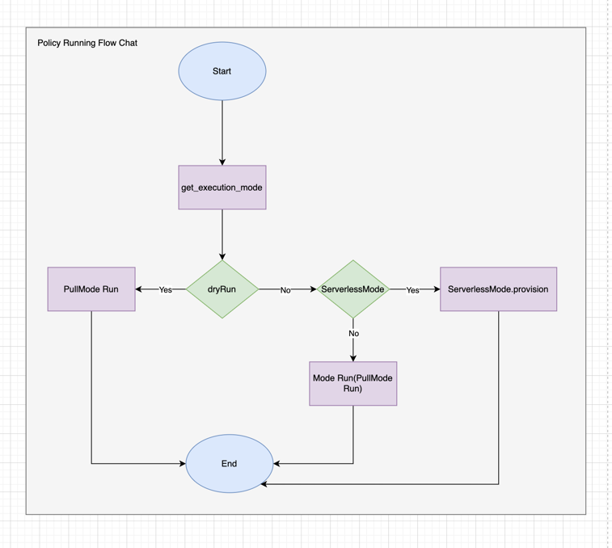
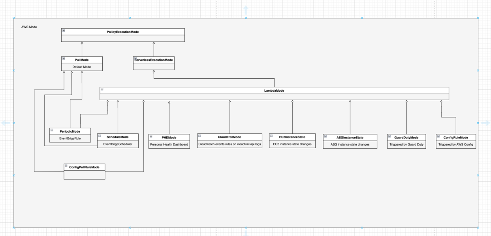
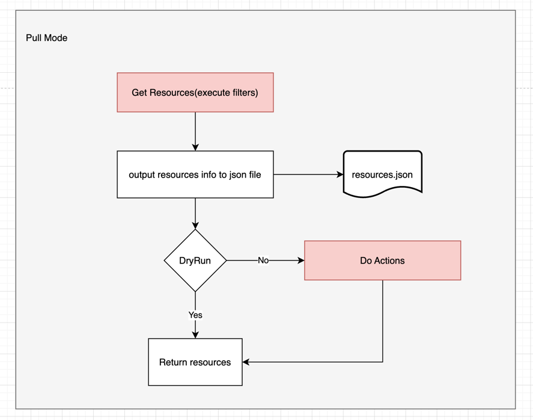
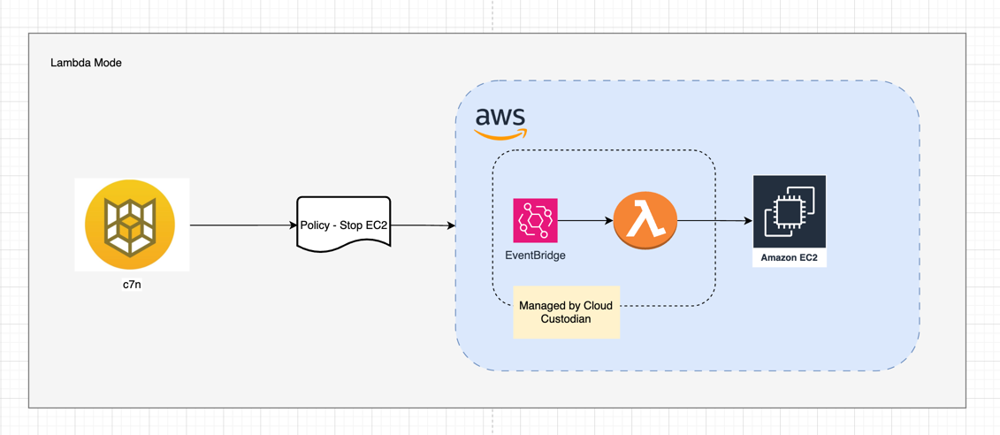

# Introduction
Custodian can run in numerous modes depending on the provider with the default being pull Mode.

## Why we need to understand mode?
Understanding the mode will help you to choose the right mode for your use case.

As shown in the diagram, the mode is the way to run the policy. The mode can be pull, or serverless.
At now, the pull mode is the default mode. And the serverless mode just one implementation which is the Lambda Mode.
The Lambda Mode has many inheritances depend on the trigger way, such as using EventBridge rules, EventBridge Schedulers etc.

## What are modes in c7n?

As shown in the `AWS Mode` diagram, you can see the inheritance of the AWS Mode.
And list modes in below:
1. Pull Mode
2. ServerLess Mode
   * Lambda Mode
     * Periodic Mode
     * Schedule Mode
     * PHD Mode
     * CloudTrail Mode
     * EC2 Instance State Mode
     * ASG Instance State Mode
     * GuardDuty Mode
     * Config Rule Mode
     * Config Pull Rule Mode

## Pull Mode
Pull Mode is default mode, which runs locally where custodian is run.

### How it works?
1. Get Resources(it will execute filters if have)
2. Output resources info to `resources.json` file in output folder
3. If not set dry-run, it will execute actions on resources which satisfy the filtering conditions.

### Pros
1. Immediate execute the policy.
2. Easily running the policy on local machine.
### Cons
1. Not suitable for schedular tasks like off-hour/on-hour, public holidays etc. (If the running time is not match the schedular time, resources will be filtered out and no actions will be executed.)

## Lambda Mode
Cloud Custodian can be run in a serverless mode using AWS Lambda. This mode is useful for running policies on a schedule, or in response to events.
### How it works?
Just need to add more configurations in the policy file, and deploy the policy it with AWS credential. The policy will automatically create a lambda function and event in AWS.

### Pros
1. Out-of-box solution, no custom work required, use the c7n-org and Lambda mode to set up directly is a conveniently way for schedule tasks.
### Cons
1. Extra work for creating and managing roles for each policy.
1. Extra work for managing Lambda and EventBridge for each policy as these are created by c7n-org and can't manage by CFN.
1. Extra work to clean up EventBridge and Lambdas for retired policies, as c7n-org is only responsible for provisioning and updating.
