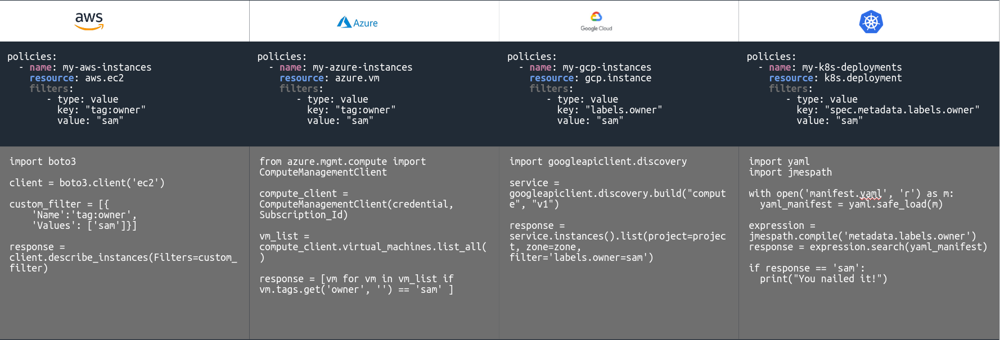

# Cloud Custodian
[Cloud Custodian](https://cloudcustodian.io/docs/index.html) is an open-source policy-as-code tool (CNCF project) designed to help manage and optimize cloud resources across major cloud providers like AWS, Azure, Google Cloud Platform, and K8s. It allows users to define and enforce policies on cloud infrastructure in a declarative, YAML-based format. These policies enable cloud administrators to automate compliance, security, and cost-optimization tasks.

## What is Cloud Custodian
Cloud Custodian enables you to manage your cloud resources by filtering, tagging, and then applying actions to them. The YAML DSL allows defininition of rules to enable well-managed cloud infrastructure that's both secure and cost optimized.

Replace ad-hoc cloud-specific scripts with simpler syntax, and Cloud Custodian will apply those policies to your infrastructure

Custodian supports managing AWS, Azure, and GCP public cloud environments with Kubernetes, Tencent Cloud, and OpenStack support in beta.

## How can Cloud Custodian help you?
### Cost Management
Setup off-hours to save money by turning off resources when they're not being used. Garbage collect unused resources by looking into utilization metrics. Easily tag and reap unused resources.

### Real-time Compliance
Custodian can actively enforce security policies by natively integrating with the cloud provider's control plane and remediating in real-time. Includes with unified metrics and reporting.

## Trade-off
### Pros:

1. Policy-as-Code: Policies are written in YAML, making it easy to declare specific actions and conditions for resources.
1. It supports multiple AWS resources, such as EC2, RDS, ASG, ECS, S3, VPC etc.
1. It supports multiple actions, such as stop, start, tag, terminate, snapshot, resize etc.
1. It supports multiple filters, such as tags, arn, metrics, image etc.
1. It supports to trigger policies by events, schedules(off-hours, public holidays), or changes in resource state(like ec2 state changes), and allowing for timely actions.
1. It supports multiple cloud such as AWS, Azure, Google Cloud, and K8s making it versatile for multi-cloud environments.
1. It supports managing resources across multiple accounts and multiple regions.
1. It supports tagging resources with specific timestamps to track automatic stopping and starting.
1. It supports custom script to implement action if Cloud Custodian does not support it yet.
1. It supports notify actions to send notifications to SNS, Slack, etc.

### Cons:
1. Extra effort for set up IAM roles in each account to allow Cloud Custodian to interact with resources.
1. Cloud custodian is an open source tool, so it may not be as reliable as AWS managed tooling. Although it has almost 5.5k stars on GitHub. However, there are many PR and issues are still open. And the community is not very active recently.
